  

  

 

  
  
  

 

---

 

  

 

  
  
  
  

 

---

 

## `/stack`

  

 

---

 

## `/now`

<table align="center">
<tr>
<td width="600">

### Currently shipping: [Kontxt](https://kontxt-zeta.vercel.app)

A structured guidance tool that helps devs use AI coding tools (Cursor, Windsurf) more accurately by generating precise planning documents — PRD, TechSpec, AppFlow, and more.

Think of it as a **context compiler for AI-assisted development**.

  
  
  

</td>
</tr>
</table>

 

---

 

## `/shipped`

<table align="center">
<tr>
<td width="50%" valign="top">

### [AhmMetro](https://ahmedabadmetro.site)
Production PWA for Ahmedabad-Gandhinagar Metro. Dijkstra routing, 54 stations, exact per-station timetables from official GMRC data (32K-line JSON). 1000+ visits. Android app in Play Store review.

`React 19` `TypeScript` `Vite` `shadcn/ui` `Vercel`

</td>
<td width="50%" valign="top">

### Cloud Alert Triage
OpenEnv-compliant RL environment for AI agent incident response across a 17-service microservice graph. Submitted to Meta x PyTorch x HuggingFace OpenEnv Hackathon 2026.

`Python` `FastAPI` `Docker` `Gymnasium`

</td>
</tr>
<tr>
<td width="50%" valign="top">

### [Inventra](https://inventra-inventory-system.onrender.com)
Multi-role inventory management system built end-to-end in under 24 hours. *3rd place at Codeversity National Hackathon @ IIT Gandhinagar 2026.*

`Node.js` `Express` `MongoDB`

</td>
<td width="50%" valign="top">

### Veda
AI-powered hospital pharmacy platform with FEFO stock management and Gemini demand prediction. *2nd place at Aetrix Hackathon @ PDEU 2026.*

`Gemini API` `Full-Stack` `Python`

</td>
</tr>
</table>

 

---

 

## `/stats`

  
  

 

  

 

  <picture>
    <source media="(prefers-color-scheme: dark)" srcset="dist/github-contribution-grid-snake-dark.svg">
    <source media="(prefers-color-scheme: light)" srcset="dist/github-contribution-grid-snake.svg">
    
  </picture>

 

  

 

---

  

